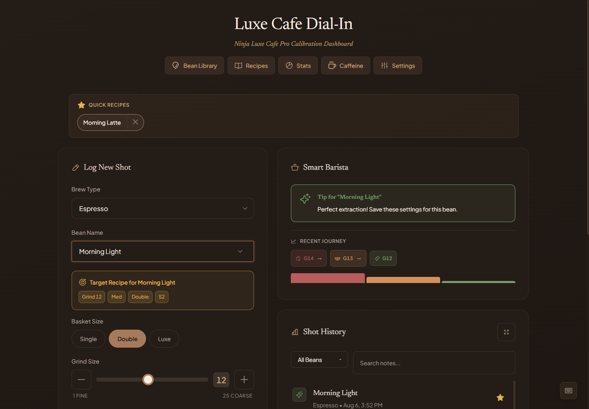

# Luxe Cafe Dashboard

**DISCLAIMER:** This is a simple personal web app built with heavy AI assistance. It's a hobby project for tracking espresso shots on the Ninja Luxe Cafe Pro, not production software. Use at your own discretion.

A small web app for logging espresso shots and dialing in beans.

**Live:** [luxe-cafe-dashboard.vercel.app](https://luxe-cafe-dashboard.vercel.app/)

> Your data is saved in your browser's localStorage. Clearing browser data or switching browsers will erase it. Use Export Backup in Settings to save a copy.



## Features

- Log shots with bean, brew type, grind, basket, temperature, strength, and a 5-point taste rating
- Bean Library with roaster, origin, roast level, process, roast date, and flavor notes
- Quick Recipes for one-click form auto-fill
- Stats: rating distribution, top beans, weekly success rate
- Caffeine tracker with daily total and 400 mg limit warning
- Optional shot timer and dose/yield ratio
- Tips based on your last shot for the same bean
- Export to JSON or CSV; import from JSON
- 5 themes; 12 or 24-hour time format

## Keyboard Shortcuts

| Shortcut | Action |
|----------|--------|
| Ctrl+Enter | Log the current shot |
| Ctrl+B | Toggle Bean Library |
| Ctrl+D | Cycle theme |
| Esc | Close any open modal |

## Run Locally

```bash
npm install
npm run dev
```

Then open http://localhost:5173.

## Tech

React 19, TypeScript, Vite. Data is persisted in browser localStorage.

## License

MIT
